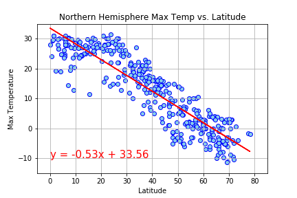

# Python API Homework - What's the Weather Like?

"What's the weather like as we approach the equator?"

Now, we know what you may be thinking: _"Duh. It gets hotter..."

Creating a Python script to visualize the weather of 500+ cities across the world of varying distance from the equator. To accomplish this, I utilized [simple Python library](https://pypi.python.org/pypi/citipy) and [OpenWeatherMap API](https://openweathermap.org/api)

To see my Python script, check jupyter notebook [here](https://github.com/fereshtehaghaei/Python-API-Challenge/blob/master/WeatherPy/WeatherPy.ipynb)


## Observation

- Southern Hemisphere climates tend to be slightly milder than those at similar latitudes in the Northern Hemisphere. This is because the Southern Hemisphere has significantly more ocean and much less land; water heats up and cools down more slowly than land.
- Highest temperature is found at 0 latitude and as the latitude increases or decreases, temperature drops. This happens as equatorial region receives sunlight straight with less or no angle due to curvature shape of earth.
- "Latitude doesn't have a strong influence on wind speed. The speed of the wind is controlled by the strength of the air pressure gradient, the stronger the pressure gradient the higher the wind speed. 


#  Part I - WeatherPy

------

- We will be creating a Python script to visualize the weather of 500+ cities across the world of varying distance from the equator.

  ###### Import Dependencies & Api Keys

## Generate Cities List

```
# List for holding lat_lngs and cities
lat_lngs = []
cities = []

# Create a set of random lat and lng combinations
lats = np.random.uniform(lat_range[0], lat_range[1], size=1500)
lngs = np.random.uniform(lng_range[0], lng_range[1], size=1500)
lat_lngs = zip(lats, lngs)

# Identify nearest city for each lat, lng combination
for lat_lng in lat_lngs:
    city = citipy.nearest_city(lat_lng[0], lat_lng[1]).city_name
    
    # If the city is unique, then add it to a our cities list
    if city not in cities:
        cities.append(city)

# Print the city count to confirm sufficient count
len(cities)
```

```
625
```

------


### Perform API Calls

- Perform a weather check on each city using a series of successive API calls.

```
{'base': 'stations',
 'clouds': {'all': 0},
 'cod': 200,
 'coord': {'lat': 22.29, 'lon': 114.16},
 'dt': 1603165437,
 'id': 1819729,
 'main': {'feels_like': 25.78,
          'humidity': 64,
          'pressure': 1015,
          'temp': 24.09,
          'temp_max': 26.11,
          'temp_min': 20},
 'name': 'Hong Kong',
 'sys': {'country': 'HK',
         'id': 2035800,
         'sunrise': 1603146094,
         'sunset': 1603187664,
         'type': 3},
 'timezone': 28800,
 'visibility': 10000,
 'weather': [{'description': 'clear sky',
              'icon': '01d',
              'id': 800,
              'main': 'Clear'}],
 'wind': {'deg': 45, 'gust': 4.47, 'speed': 0.89}}
```

------

### Print log of each city

- Include a print log of each city as it's being processed (with the city number and city name).

  ```
  Beginning Data Retrieval
  -------------------------------
  Processing Record 1 of Set 1 | Dikson
  Processing Record 2 of Set 1 | Rikitea
  Processing Record 3 of Set 1 | San Cristobal
  Processing Record 4 of Set 1 | Ushuaia
  Processing Record 5 of Set 1 | Busselton
  Processing Record 6 of Set 1 | Moindou
  Processing Record 7 of Set 1 | Coquimbo
  Processing Record 8 of Set 1 | Cape Town
  Processing Record 9 of Set 1 | Fortuna
  Processing Record 10 of Set 1 | Provideniya
  Processing Record 11 of Set 1 | Bonavista
  Processing Record 12 of Set 1 | Souillac
  Processing Record 13 of Set 1 | Casino
  Processing Record 14 of Set 1 | Warwick
  Processing Record 15 of Set 1 | Kalmunai
  Processing Record 16 of Set 1 | Hasaki
  Processing Record 17 of Set 1 | Leningradskiy
  Processing Record 18 of Set 1 | Jamestown
  Processing Record 19 of Set 1 | Bethel
  Processing Record 20 of Set 1 | Vila Franca do Campo
  Processing Record 21 of Set 1 | Tiksi
  Processing Record 22 of Set 1 | Hong Kong
  Processing Record 23 of Set 1 | La Crosse
  City Not Found. Skippig....
  ```


# Plotting the Data

- Use proper labeling of the plots using plot titles (including date of analysis) and axes labels.
- Save the plotted figures as .pngs.

### Latitude vs. Temperature Plot

```
# Create a Scatter Plot for temperature vs. latitude
# Create a title, x label, and y label for our chart

plt.title(f"City Latitude vs. Max Temperature ({my_date})")
x_values = weather_data["Lat"]
y_values = weather_data["Max Temp"]
plt.scatter(x_values,y_values, alpha = 1, marker = 'o', facecolors = 'skyblue', edgecolors ='black')
plt.xlabel("Latitude")
plt.ylabel("Max Temperature (°F)")
plt.grid(True)

# Save the figure
plt.savefig("../Images/Lat_vs_Temp_Scatterplot.png")

# Display Graph
plt.show()
```


## Latitude vs. Humidity Plot


## Latitude vs. Cloudiness Plot


## Latitude vs. Wind Speed Plot


## Northern & Southern Hemisphere DataFrame

```
# Create Northern and Southern Hemisphere DataFrames
northern_hemisphere = weather_data.loc[weather_data["Lat"] >= 0]
southern_hemisphere = weather_data.loc[weather_data["Lat"] <= 0]

#northern_hemisphere.head()
#southern_hemisphere.head()
```


#### Northern Hemisphere - Max Temp vs. Latitude Linear Regression

```
# Create new x and y values for Northern Hemisphere
x_values = northern_hemisphere['Lat']
y_values = northern_hemisphere['Max Temp']

# Perform a linear regression on Northern Hemisphere Max Temp vs. Latitude
(slope, intercept, rvalue, pvalue, stderr) = stats.linregress(x_values,y_values)

# Get regression values:create equation of line to calculate temp vs. Latitude
regress_values = x_values * slope + intercept

#Create a Scatter Plot for Lattitude vs Temperature of City
plt.scatter(x_values,y_values, alpha = 1, marker = 'o', facecolors = 'skyblue', edgecolors ='blue')
plt.xlabel("Latitude")
plt.ylabel("Max Temperature")
plt.title('Northern Hemisphere Max Temp vs. Latitude')
plt.grid(True)

# Regression line on graph
plt.plot(x_values, regress_values,"-", color='red')

# linear equation
line_eq = "y = " + str(round(slope,2)) + "x + " + str(round(intercept,2))

# printing leaner equation on graph
plt.annotate(line_eq,(0,-10),fontsize=15,color="red")

#settin x and y axis limits
plt.ylim(-15,35)
plt.xlim(-5, 85)

# Save the figure
plt.savefig("../Images/Northern_Hem_Lat_vs_Temp_Scatterplot.png")

# Display Graph
plt.show()

# R-Value
print(f"The r-value is: {rvalue**2}")

# Calculate the correlation coefficient 
print(f"The correlation between Latitude and Max Temperature in Northern Hemisphere is {round(st.pearsonr(x_values,y_values)[0],2)}")
```




```
The r-value is: 0.8159776172443847
The correlation between Latitude and Max Temperature in Northern Hemisphere is -0.9
```


#### Southern Hemisphere - Max Temp vs. Latitude Linear Regression


```
The r-value is: 0.4866761323760189
The correlation between Latitude and Max Temperature in Southern Hemisphere is 0.7
```


#### Northern Hemisphere - Humidity (%) vs. Latitude Linear Regression


```
The r-value is: 0.0763245518304966
The correlation between Latitude and Humidity in Northern Hemisphere is 0.28
```


#### Southern Hemisphere - Humidity (%) vs. Latitude Linear Regression


```
The r-value is: 0.020275065972691547
The correlation between Latitude and Humidity in Southern Hemisphere is 0.14
```


#### Northern Hemisphere - Cloudiness (%) vs. Latitude Linear Regression


```
The r-value is: 0.07149840247516427
The correlation between Latitude and Cloudiness in Northern Hemisphere is 0.27
```


#### Southern Hemisphere - Cloudiness (%) vs. Latitude Linear Regression


```
The r-value is: 0.03918331683452775
The correlation between Latitude and Cloudiness in Southern Hemisphere is 0.2
```


#### Northern Hemisphere - Wind Speed (mph) vs. Latitude Linear Regression


```
The r-value is: 0.005313203667376115
The correlation between Latitude and Wind Speed(mph) in Northern Hemisphere is 0.07
```


#### Southern Hemisphere - Wind Speed (mph) vs. Latitude Linear Regression


```
The r-value is: 0.13204377443082696
The correlation between Latitude and Wind Speed(mph) in Southern Hemisphere is -0.36
```


# Part II - VacationPy

I used jupyter-gmaps and the Google Places API and used my skills in working with weather data to plan future vacations. 

### Plotting Heatmap

- Create a heat map that displays the humidity for every city from the part I of the project.

  

- Narrow down the DataFrame to find my ideal weather condition. For example:

  - A max temperature lower than 80(°F) degrees but higher than 70(°F). For this section, I used metric measurement so my max temp lower than 26.66(°C) but higher than 21.1(°C)
  - Wind speed less than 10 mph.
  - Zero cloudiness.
  - Drop any rows that don't contain all three conditions.

  ### Hotel Map

  - Store into variable named `hotel_df`.

  - Add a "Hotel Name" column to the DataFrame.

  - |      |            City | Country |    Lat |     Lng | Hotel Name                        |
    | ---: | --------------: | ------: | -----: | ------: | --------------------------------- |
    |    1 |         Rikitea |      PF | -23.12 | -134.97 | Pension Maro'i                    |
    |   21 |       Hong Kong |      HK |  22.29 |  114.16 | The Harbourview                   |
    |   43 |         Yorosso |      ML |  12.35 |   -4.78 |                                   |
    |  179 |           Ţahţā |      EG |  26.77 |   31.50 | El Salam Hotel                    |
    |  184 |     Tambacounda |      SN |  13.75 |  -13.76 |                                   |
    |  212 |     Mitsamiouli |      KM | -11.38 |   43.28 | Al Camar Lodge                    |
    |  278 |           Aswān |      EG |  24.09 |   32.91 | Sofitel Legend Old Cataract Aswan |
    |  341 |  Cap Malheureux |      MU | -19.98 |   57.61 | Paradise Cove Boutique Hotel      |
    |  380 |         Longhua |      CN |  23.61 |  114.19 |                                   |
    |  434 | Bandar-e Lengeh |      IR |  26.56 |   54.88 | Diplomat Hotel                    |

  

  

  ## To run the code:

  - Install citypy in your python environment (https://pypi.python.org/pypi/citipy)
  - Save OpenWeatherMap API Key (https://openweathermap.org/) as 'weather_api_key'
  - Google API Key (https://console.developers.google.com/getting-started) as 'g_key'
  - Create API Keys and store it in the 'api_keys.py' file before running the Jupyter notebooks.